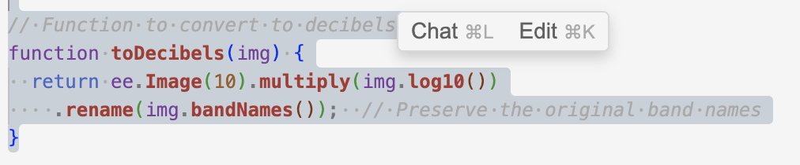
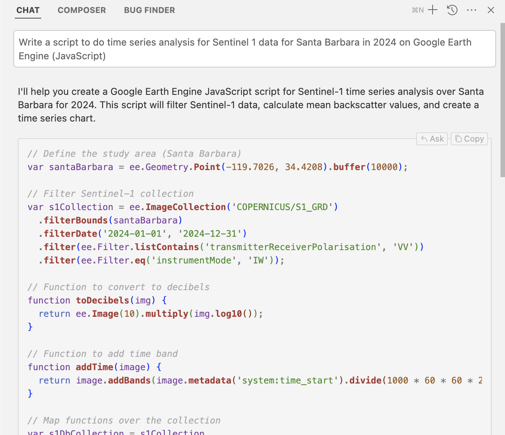
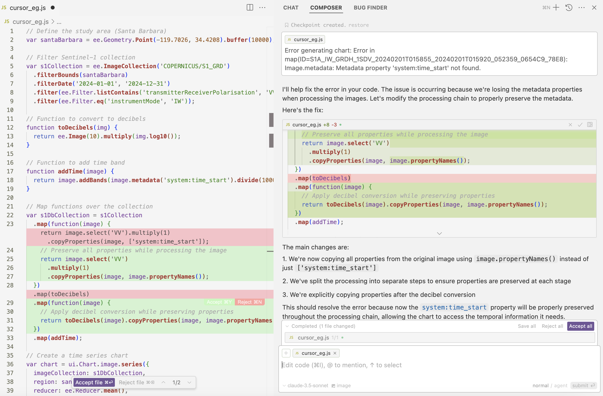
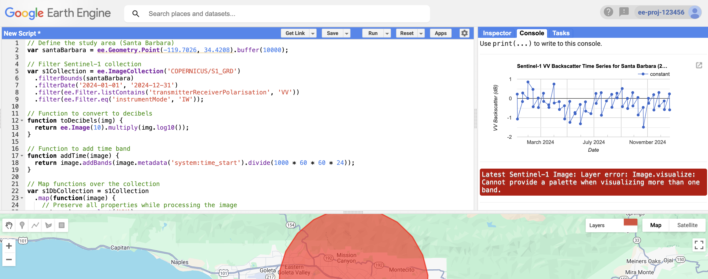
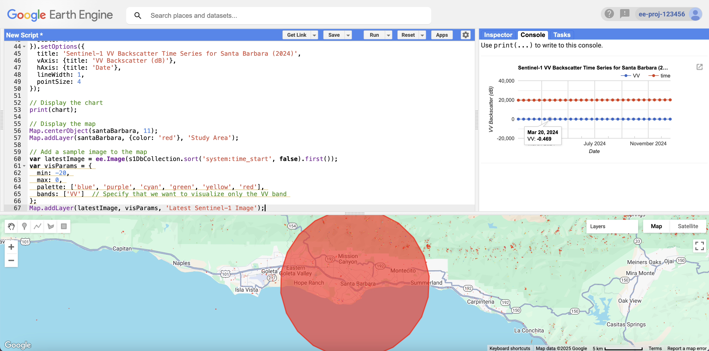

# Speed up your coding with Cursor!
### An example of generating a Google Earth Engine code for time series analysis

Imagine you want to try out a cool method or a new tool but are worried about the steep learning curve or the massive time investment in endless searches for example codes that might end up creating more chaos.... Cursor might be worth checking out!

## Table of content

* What is cursor?
* Pros and Cons in a nutshell
* Key features and function highlights
* Example: Generating a Google Earth Engine code for time series analysis
* Closing remarks

### What is cursor?

Greetings from cursor:

"Hello Environmental Data Scientists!
I'm Cursor, an AI-enhanced code editor designed to make your data analysis and research workflows more efficient. Think of me as your intelligent coding partner that understands both code and context, particularly useful for environmental data science work."

Okay, that's the ad cursor wrote for itself. While I remain conservative about how good it can handle EDS specific context and how it can be particularly useful for EDS work, cursor has demonstrated some impressive capability to help make coding more efficient.

So in even simpler terms for an introduction, cursor helps write code more efficiently, and can make writing longer codes less intimidating (personal opinion). So if you're already coding, but sometimes still find certain coding task overwhelming, cursor (and the like) might be something worth checking out.

#### Pros and Cons in a nutshell

**Cursor is good at ...**

- All things that a browser-based AI coding tool can do
Example: explaining concepts and annotating code.

- Reduce time in coding something you have relatively little knowledge about
Example: "I've always wanted to build a deep learning model, but I don't know how. Oh, why don't I ask cursor to generate a script to build a model with torch-geo." After giving a proper prompt (or a casual prompt to start with), cursor is able to generate one or multiple inter-related scripts (depending on the user's requirement)

- Reduce time in searching for examples on the internet (that may not work)

- Identify potential inconsistencies and where can be improved
Example: the user can ask cursor if there is potential inconsistencies across scripts and ask for advice on how to improve, and cursor will give suggestions accordingly.

- Improve coding efficiency through features such as code autocompletion

**Cursor still needs you on these tasks ...**

- Have good knowledge on what you want to achieve (domain knowledge + clarity on the analytical task)

- Take over from time to time especially when the scripts get heavy
While cursor is extremely great at generating code or suggesting/handling directory structure (i.e., which folder which file should belong), they can be lost sometimes when a parameter in one script is changed that also affects the other code. This is when the user needs to take over.

- Know your goal clearly and the "right" questions to ask
Given the extremely diverse user needs for code improvement, cursor is not going to overwhelm the user with all potential options. Therefore, the user needs to ask for very specific direction to improve on, such as for cost reduction or faster speed. The user can always ask cursor "how can I improve this code" anyways.

- Double check and make sure the information cursor gives you is up to date and accurate
Example: when I tried cursor out in January, 2025, Cursor did not provide "gpt-4o-mini" as an option for querying the api from openai, so I had to use links and evidence to "convince" it. Especially in cases where things are updating fast, the user should keep an active mind and make sure everything works theoretically (e.g., if the api supports the data format you want to have).

#### Key features and function highlight

Cursor has a comprehensive overview of key features on its [webpage](https://www.cursor.com/features). I am highlighting some of those I've tested out and find useful.

- Chat
After opening cursor, the user can access "chat", "composer", and "bug finder" functions. To access these, click the very top right button and then these functions will appear on the right tab.

"chat" is a great function to interact with cursor to ask questions and get some answers in general. It does not make changes to your code directly, but it can be a good starting point to explore different options.

- Composer
"composer" is the function right next to "chat" that can make direct changes to the codes. Users can either accept or reject any change.

- Chat and edit in the code
The above functions are all located on the right tab, we can also leverage cursor to interact with code more directly on the left panel. There are "chat" and "edit" options near any selected text. This "chat" option near code line on the left panel allows you to give context information (i.e., the couple of lines of code the user selected) to further chat with cursor. The "edit" option allows users to give more editing instructions

- Tab key
There are many cool tricks one can do with the autocompletion function using tab key. The one example I tried before was automatically changing variable names across functions and scripts.

### Example: Generating a Google Earth Engine code for time series analysis

#### 1. Download and set up
Please see these document for how to download and install cursor to a local device.

#### 2. Try "chat" function

Write a task for cursor and it will generate the code.

Then copy paste the code to try it out in the Google Earth Engine Code Editor following cursor's instructions. There are errors returned. Let's try debug it with cursor.

#### 3. Try "composer" function

Open a folder on the left hand side of the bar. Create a ".js" file and copy paste the code into that file.

People can try better ways to interact, but personally, I just copy pasted the error message to cursor.

Read through the explanation and changes to decide on which changes to keep or reject.

After the first round of changes, the chart is now able to generate a chart in GEE code editor. But there remains another error.

Copy paste the remaining error again and do these procedure iteratively. After about 2 rounds of changes, we have a working script now! This whole process takes about 5 mins and no need to write a single line of code.

Building from this, we can give more commands to cursor to improve the analysis or the visualization. Iteration is still a huge part of this process!

### Closing remarks

Despite all the amazing things that cursor can do, it is always better to set our expectations realistically, knowing what it is good at and what not. Having a plan ahead of time, start from simple, and make changes iteratively, all the best practice advice from the pre-AI coding era, are still very valuable best practices that people should keep in mind and follow.
