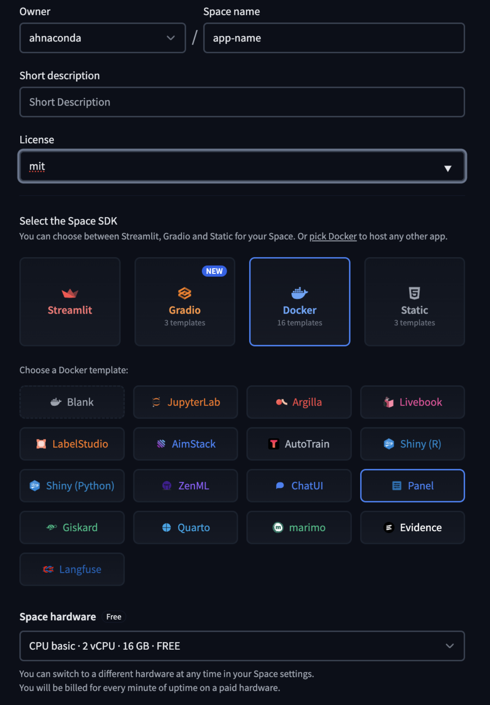
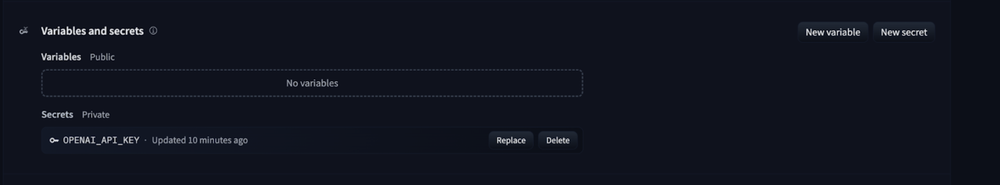

# End to End App deployment using Huggingface

This app allows users to upload a file and extract text-based content from it based on user-defined instructions.

panel: Provides the interactive UI with a file dropper, text input, and extract button.
marvin: Handles text extraction using an OpenAI language model (gpt-4o-mini).
markitdown: Converts uploaded documents into text format.
io & os: Manage file handling and processing.

The app supports text and image files but does not handle videos.

To deploy an app on HuggingFace (shareable & free) use the following steps:

1. first create a new space [https://huggingface.co/new-space](https://huggingface.co/new-space) and select the following options to deploy a Panel app:
   


2. Then edit the `app.py` file under `files`


insert the following code:

```python
import io
import os
import marvin
import io
import os
import marvin
import markitdown
import panel as pn

pn.extension("filedropper")

marvin.settings.openai.chat.completions.model = "gpt-4o-mini"

def convert(value: dict):
    for filename, content in value.items():
        file_extension = os.path.splitext(filename)[1]
        if file_extension in (".png", ".jpg", ".jpeg", ".gif"):
            return marvin.Image(content, format=file_extension.lstrip("."))
        elif file_extension in (".mp4", ".mov", ".avi"):
            raise NotImplementedError("Video files are not supported yet.")
        if isinstance(content, bytes):
            buf = io.BytesIO(content)
        else:
            buf = io.StringIO(content)
        content = mid.convert_stream(buf, file_extension=file_extension)
        return content.text_content


def extract(event):
    content = convert(file_dropper.value)
    instructions = text_input.value
    output = marvin.extract(content, instructions=instructions)
    results.object = output


mid = markitdown.MarkItDown()
file_dropper = pn.widgets.FileDropper(
    multiple=False, height=370, sizing_mode="stretch_width"
)
text_input = pn.widgets.TextInput(
    placeholder="Things to extract",
    visible=file_dropper.param.value.rx().rx.len() > 0,
    sizing_mode="stretch_width",
)
submit_button = pn.widgets.Button(
    name="Extract",
    on_click=extract,
    visible=text_input.param.value.rx().rx.len() > 0,
    sizing_mode="stretch_width",
)
results = pn.pane.Placeholder()
template = pn.template.FastListTemplate(
    main=[file_dropper, text_input, submit_button, results],
    main_max_width="800px",
    main_layout=None,
)
template.servable()
```

3. Now update `requirements.txt` which specifies the packages needed

```
panel
jupyter
markitdown
marvin
openai

```

4. Lastly, update the secrets to iunclude your private info such as your API keys



----

A deployed version of this app can be found here [https://huggingface.co/spaces/ahnaconda/pdf-extraction](https://huggingface.co/spaces/ahnaconda/pdf-extraction)


